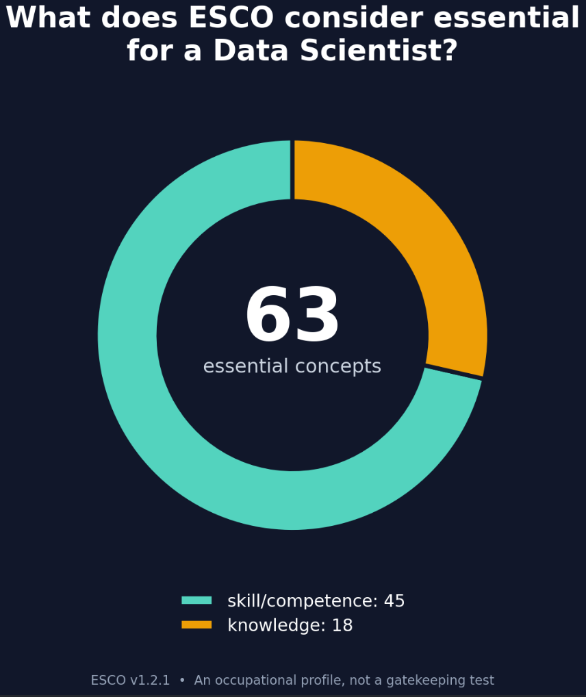

# SkillBridge — exploring Data & AI occupations with ESCO

SkillBridge explores how ESCO skills relate to nine selected Data and AI occupations. The notebook cleans and joins ESCO data, compares essential-skill overlap, tests a small occupation recommender, and exports tables for a Power BI dashboard.



## What is in this repository?

| File or folder | Purpose |
| --- | --- |
| `SkillBridge_Project.ipynb` | Analysis, SQL, visualizations, statistical tests, model evaluation, and interactive recommendation example |
| `SkillBridge_Dashboard.pbix` | Power BI report; open with Power BI Desktop |
| `powerbi_exports/` | Small, prepared CSV tables used for reporting (including model metrics and example recommendations) |
| `assets/` | Project illustration |

The current export contains **9 occupations**, **293 distinct concepts**, and **717 occupation–concept links**. The notebook compares Logistic Regression and K-nearest neighbours trained on simulated partial skill profiles. The reported Logistic Regression test accuracy and macro F1 are approximately **97.2%** on **360 simulated test profiles**; the result is **not** a validated prediction rate for real people or CVs.

## Run the notebook

1. Download the **English CSV package of ESCO v1.2.1** from the [official ESCO download page](https://esco.ec.europa.eu/en/use-esco/download).
2. Put these three files **next to** `SkillBridge_Project.ipynb` (not inside `powerbi_exports/`):

   - `occupations_en.csv`
   - `skills_en.csv`
   - `occupationSkillRelations_en.csv`

3. In a Python environment, install the packages in `requirements.txt` and open the notebook:

   ```bash
   python -m pip install -r requirements.txt
   jupyter lab SkillBridge_Project.ipynb
   ```

4. Run the cells from the beginning. The final interactive cell accepts comma-separated ESCO skill names and ranks the nine included occupations.

The raw ESCO files are not copied into this repository. The notebook expects them in its working directory and generates `skillbridge.db` during execution. If you launch Jupyter from elsewhere, change its working directory to this repository first. The exported CSVs are provided to inspect the existing results, but do not replace the full raw files needed to rerun the analysis.

## Open the dashboard

Open `SkillBridge_Dashboard.pbix` in Power BI Desktop. The prepared CSV exports are included in `powerbi_exports/`. If Power BI asks to refresh a source from the author's computer, change its file path in **Transform data → Data source settings** to the corresponding CSV in your local `powerbi_exports/` folder. This report has not been tested on every Power BI Desktop installation.

## How to interpret the result

The recommender maps an entered ESCO skill name to its concept ID, then compares the resulting concept-token profile with patterns learned from **simulated** ESCO-based examples. Its percentage-like model scores are relative to the **nine selected occupations**; they are **not** the chance of getting a job. Training and test profiles come from the same ESCO occupation templates, so the high test score likely overstates real-world performance. Use this as an exploratory prototype, not for hiring decisions.

## Source and attribution

Occupation and skill data: [European Commission, ESCO v1.2.1](https://esco.ec.europa.eu/en/use-esco/download). The dataset is available from the ESCO portal; this repository contains derived excerpts and tables for this project. The analysis and interpretation are the author's, not an endorsement by ESCO or the European Commission.

No license has been assigned to the author's notebook or report here; contact the author about reuse of that original work.
